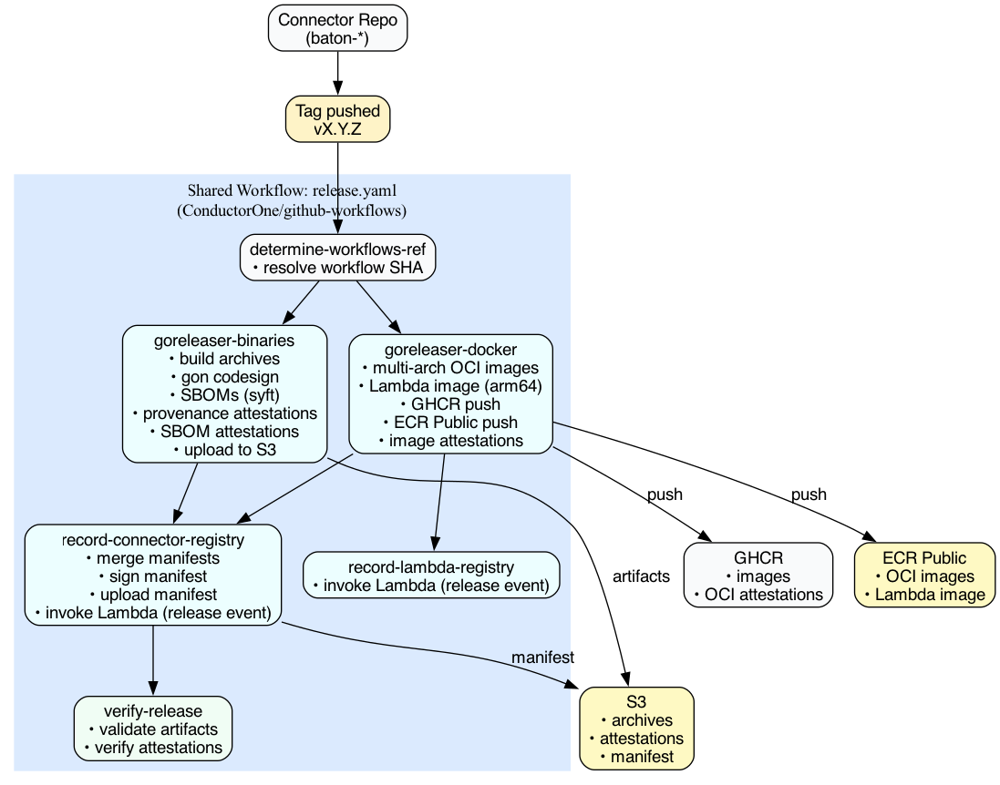

# Release Workflow

The `release.yaml` workflow handles the complete release process for connector repositories, including building, signing, attestation, and publishing.

## Overview



When a tag is pushed to a connector repository, the shared release workflow:

1. Builds binaries for all platforms (macOS, Linux, Windows)
2. Builds multi-arch Docker images
3. Signs all artifacts with Sigstore (keyless)
4. Generates SLSA provenance attestations
5. Publishes to S3, GHCR, and ECR Public
6. Records the release in the connector registry

## Jobs

### determine-workflows-ref

Resolves the exact SHA of the shared workflow being used. This pinned reference is embedded in all provenance attestations, ensuring verifiability.

### goreleaser-binaries (macOS)

Builds and signs binary archives:

- Cross-compiles for darwin/linux/windows (amd64/arm64)
- Apple codesigning via gon
- Generates SBOMs using Syft
- Creates SLSA v1 provenance attestations
- Signs SBOMs as attestation bundles
- Uploads all artifacts to S3

**Outputs:** `*.zip`, `*.tar.gz`, `*.provenance.sigstore.json`, `*.sbom.sigstore.json`

### goreleaser-docker (Linux)

Builds and publishes container images:

- Multi-arch Docker images (amd64/arm64)
- Pushes to GHCR (public registry)
- Pushes to ECR Public (for Lambda deployment)
- Attaches provenance attestations to images (OCI referrers)

**Outputs:** GHCR and ECR Public images with attached attestations

### record-connector-registry

Finalizes the release:

- Merges binary and image manifests
- Signs `manifest.json` with Sigstore
- Uploads manifest to S3
- Invokes release recording Lambda

### verify-release

Post-release validation (non-blocking):

- Validates all artifacts are accessible
- Verifies all attestations with cosign
- Triggers Datadog notification on failure

## Security Properties

### Keyless Signing

All signatures use Sigstore's keyless signing:

- No long-lived keys to manage or rotate
- Identity based on GitHub Actions OIDC token
- Signatures recorded in Rekor transparency log

### Provenance Attestations

Every artifact includes SLSA v1 provenance that links it to:

- Source repository and commit
- Workflow that built it (pinned SHA)
- Build environment (runner OS, architecture)
- Build timestamp

### SBOM Attestations

Software Bill of Materials (SPDX format) for each binary:

- Generated by Syft during build
- Signed as in-toto attestation
- Links SBOM to the specific artifact

### Verification

Anyone can verify artifacts using cosign:

```bash
# Verify binary provenance
cosign verify-blob-attestation \
  --bundle artifact.provenance.sigstore.json \
  --type https://slsa.dev/provenance/v1 \
  --certificate-oidc-issuer https://token.actions.githubusercontent.com \
  --certificate-identity-regexp 'https://github.com/ConductorOne/github-workflows/.github/workflows/release.yaml@.*' \
  artifact.zip

# Verify image provenance
cosign verify-attestation \
  --type https://slsa.dev/provenance/v1 \
  --certificate-oidc-issuer https://token.actions.githubusercontent.com \
  --certificate-identity-regexp 'https://github.com/ConductorOne/github-workflows/.github/workflows/release.yaml@.*' \
  ghcr.io/conductorone/baton-foo@sha256:abc123
```

### Certificate Identity

All attestations are signed with a certificate containing:

- **Issuer:** `https://token.actions.githubusercontent.com`
- **Identity:** `https://github.com/ConductorOne/github-workflows/.github/workflows/release.yaml@<ref>`

Verification requires matching both issuer and identity pattern.

## Directory Structure

```
$GITHUB_WORKSPACE/
├── _caller/              # Connector repo checkout
│   └── dist/             # GoReleaser output, attestation bundles
└── _workflows/           # github-workflows repo checkout
    ├── _generated/       # Generated configs (goreleaser, gon, predicate)
    ├── _output/          # Final manifest and signatures
    ├── templates/        # Source templates
    └── cmd/              # Go commands
```

## S3 File Structure

```
releases/{org}/{repo}/{tag}/
├── manifest.json
├── manifest.json.sig
├── manifest.json.cert
├── baton-foo-v1.0.0-darwin-arm64.zip
├── baton-foo-v1.0.0-darwin-arm64.zip.provenance.sigstore.json
├── baton-foo-v1.0.0-darwin-arm64.zip.sbom.sigstore.json
└── ...
```

## Testing Changes

### Test Repositories

Use test connectors for validation:

- `ConductorOne/baton-github-test` - Full release testing

### Testing Process

1. Make workflow changes on a branch
2. Point test repo at your branch:
   ```yaml
   uses: ConductorOne/github-workflows/.github/workflows/release.yaml@your-branch
   ```
3. Create a test release on test connector repo via UI
4. Wait for workflow to complete
5. Validate outputs:
   ```bash
   ./scripts/validate-release-artifacts.sh ConductorOne/baton-github-test v0.1.xxx
   ```

### Validation Script

The `scripts/validate-release-artifacts.sh` script validates:

- Manifest structure and version match
- All binary assets are downloadable
- Provenance and SBOM attestations exist and verify
- GHCR and ECR Public image attestations (if present)
- Manifest signature (if present)

```bash
./scripts/validate-release-artifacts.sh ORG/REPO VERSION
```

Exit codes: `0` = all passed, `1` = failures

### Manual Verification

```bash
# Download and verify binary provenance
curl -LO "https://dist.conductorone.com/releases/ConductorOne/baton-github-test/v0.1.102/baton-github-test-v0.1.102-darwin-arm64.zip"
curl -LO "https://dist.conductorone.com/releases/ConductorOne/baton-github-test/v0.1.102/baton-github-test-v0.1.102-darwin-arm64.zip.provenance.sigstore.json"

cosign verify-blob-attestation \
  --bundle baton-github-test-v0.1.102-darwin-arm64.zip.provenance.sigstore.json \
  --type https://slsa.dev/provenance/v1 \
  --certificate-oidc-issuer https://token.actions.githubusercontent.com \
  --certificate-identity-regexp 'https://github.com/ConductorOne/github-workflows/.github/workflows/release.yaml@.*' \
  baton-github-test-v0.1.102-darwin-arm64.zip
```

### Common Issues

- **Cosign version:** Ensure using latest cosign (`cosign version`)
- **GHCR access:** May need `docker login ghcr.io` for image verification
